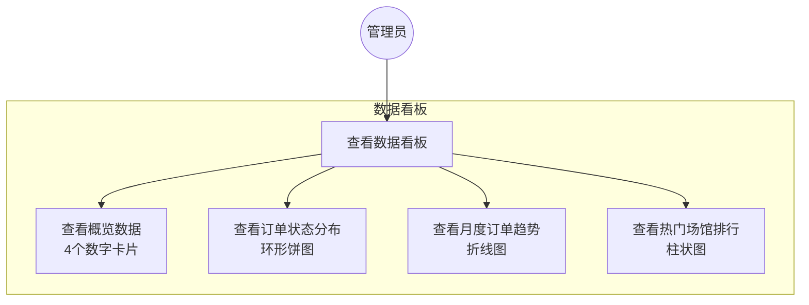
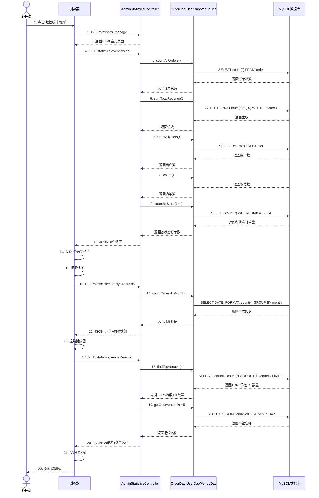
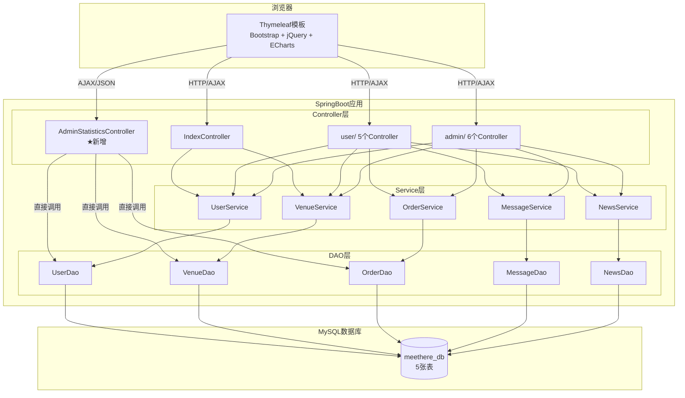
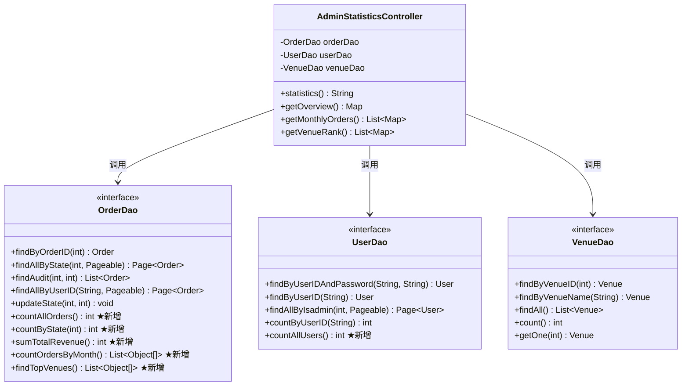
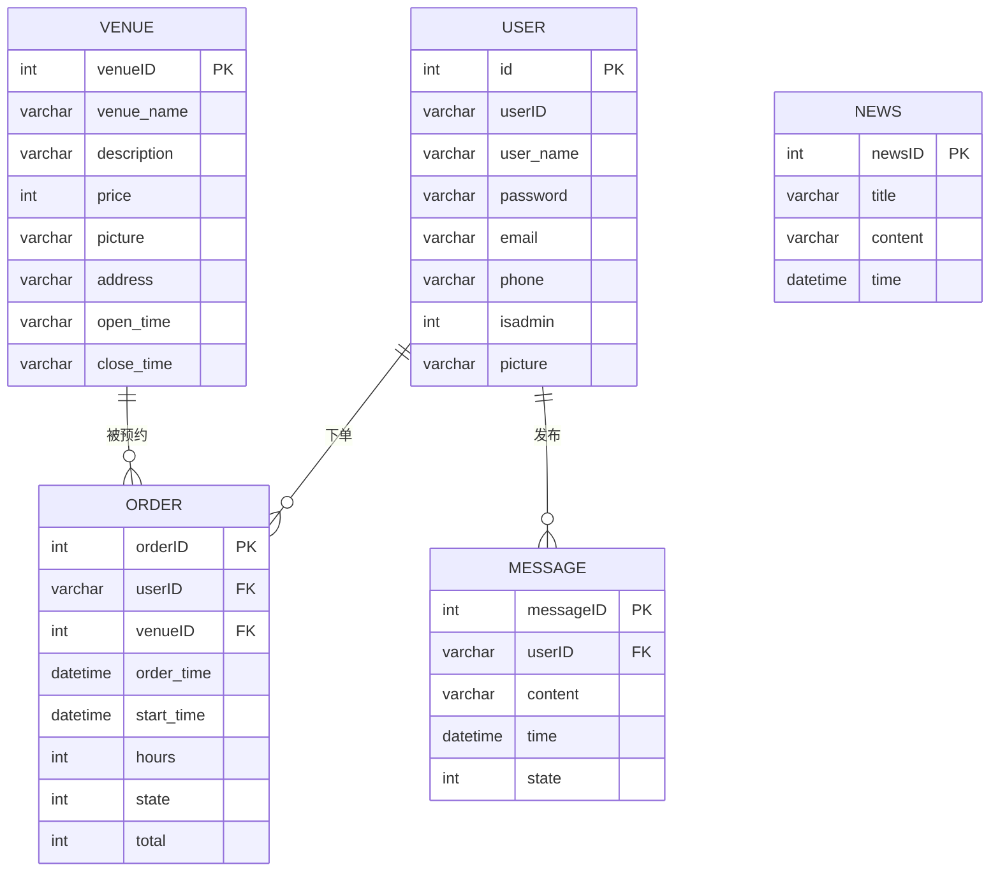

# 图表生成代码

使用以下代码在 Mermaid 在线编辑器（https://mermaid.live）中粘贴即可生成图片。

---

## 图1：用例图



---

## 图2：时序图



---

## 图3：活动图

```mermaid
flowchart TD
    A([开始]) --> B[管理员点击左侧菜单"数据统计"]
    B --> C[浏览器发送GET请求到/statistics_manage]
    C --> D[后端返回HTML空壳页面]
    D --> E[JS自动发出4个AJAX请求]
    E --> F[后端查询数据库返回JSON数据]
    F --> G[前端渲染4个数字卡片]
    G --> H[前端渲染饼图]
    H --> I[前端渲染折线图]
    I --> J[前端渲染柱状图]
    J --> K([结束])
```

---

## 图4：系统架构图



---

## 图5：类图 — 新增和修改的类



---

## 图6：数据库E-R图



---

## 图7：页面结构图

```mermaid
graph TB
    subgraph statistics.html
        subgraph 顶部导航栏
            NAV[layout/header.html]
        end
        subgraph 左侧菜单
            LEFT[layout/left.html<br/>★新增"数据统计"菜单项]
        end
        subgraph 主内容区
            subgraph 概览卡片
                C1[总订单数]
                C2[总营收]
                C3[总用户数]
                C4[总场馆数]
            end
            subgraph 图表区域
                PIE[订单状态饼图<br/>id=pieChart]
                LINE[月度趋势折线图<br/>id=lineChart]
                BAR[热门场馆柱状图<br/>id=barChart]
            end
            FOOTER[layout/footer.html]
        end
    end

    AJAX1[AJAX: /statistics/overview.do] --> C1
    AJAX1 --> C2
    AJAX1 --> C3
    AJAX1 --> C4
    AJAX1 --> PIE
    AJAX2[AJAX: /statistics/monthlyOrders.do] --> LINE
    AJAX3[AJAX: /statistics/venueRank.do] --> BAR
```
