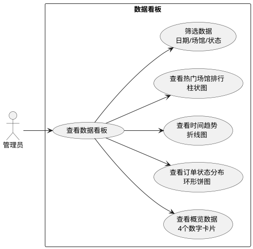
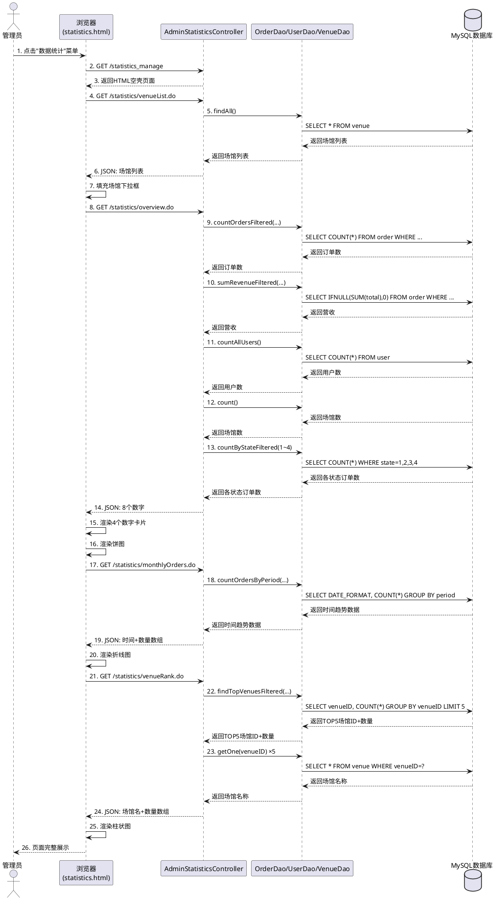
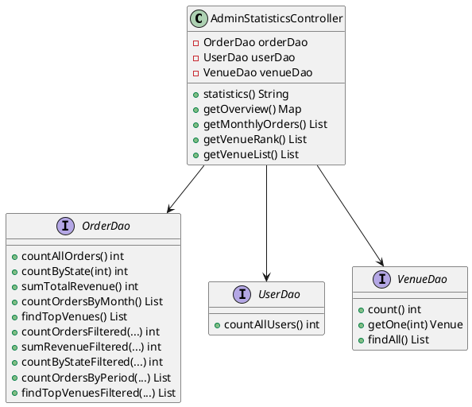
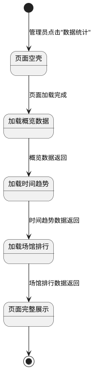
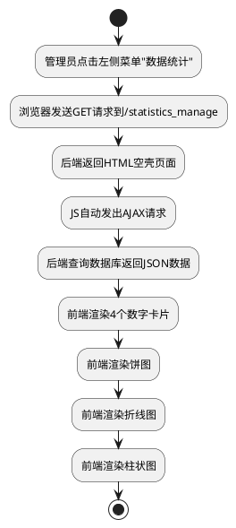
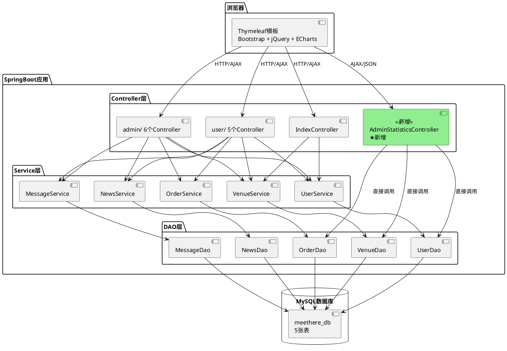

# MeetHere 新功能开发文档 — 管理员数据看板

---

## 一、功能概述

在MeetHere场馆预约管理系统原有基础上，团队新增了**管理员数据看板**功能。管理员登录后台后，可通过左侧菜单进入"数据统计"页面，页面以数字卡片和ECharts图表的形式展示平台运营数据，包含概览数据、订单状态分布、时间趋势、热门场馆排行四个模块，并支持多维度筛选。

### 功能价值

- 管理员无需逐个查看订单、用户、场馆列表，一眼掌握平台整体运营状况
- 通过饼图快速判断待审核订单是否积压，及时处理
- 通过折线图观察订单量的变化趋势
- 通过柱状图了解哪些场馆最受欢迎，辅助场馆运营决策
- 通过筛选功能，可以查看特定时间段、场馆、状态的数据

---

## 二、新需求模型

### 2.1 用例图

```
┌─────────────────────────────────────────────────────────┐
│                    管理员 (Actor)                         │
│                                                          │
│   ┌──────────────────────────────────────────────────┐  │
│   │            查看数据看板 (UC-1)                      │  │
│   │                                                    │  │
│   │   ┌──────────────┐    ┌──────────────────┐       │  │
│   │   │ 查看概览数据   │    │ 查看订单状态分布   │       │  │
│   │   │ (UC-1.1)     │    │ (UC-1.2)         │       │  │
│   │   │ 4个数字卡片   │    │ 环形饼图          │       │  │
│   │   └──────────────┘    └──────────────────┘       │  │
│   │                                                    │  │
│   │   ┌──────────────┐    ┌──────────────────┐       │  │
│   │   │ 查看时间趋势   │    │ 查看热门场馆排行   │       │  │
│   │   │ (UC-1.3)     │    │ (UC-1.4)         │       │  │
│   │   │ 折线图        │    │ 柱状图            │       │  │
│   │   └──────────────┘    └──────────────────┘       │  │
│   │                                                    │  │
│   │   ┌──────────────┐                                │  │
│   │   │ 筛选数据      │                                │  │
│   │   │ (UC-1.5)     │                                │  │
│   │   │ 日期/场馆/状态 │                                │  │
│   │   └──────────────┘                                │  │
│   └──────────────────────────────────────────────────┘  │
└─────────────────────────────────────────────────────────┘
```

**用例说明**：

| 用例编号 | 用例名称 | 前置条件 | 基本流程 | 后置条件 |
|---------|---------|---------|---------|---------|
| UC-1 | 查看数据看板 | 管理员已登录 | 1. 管理员点击左侧菜单"数据统计"<br>2. 系统加载统计页面<br>3. 前端自动发出AJAX请求<br>4. 后端查询数据库返回JSON<br>5. 前端渲染数字卡片和图表 | 页面展示完整的数据看板 |
| UC-1.1 | 查看概览数据 | 进入数据看板页面 | 1. 前端请求 /statistics/overview.do<br>2. 后端统计订单总数、营收、用户数、场馆数<br>3. 返回JSON，前端渲染4个数字卡片 | 展示4个概览指标 |
| UC-1.2 | 查看订单状态分布 | 进入数据看板页面 | 1. 前端请求 /statistics/overview.do<br>2. 后端统计4种状态各自的订单数<br>3. 返回JSON，ECharts渲染环形饼图 | 展示订单状态饼图 |
| UC-1.3 | 查看时间趋势 | 进入数据看板页面 | 1. 前端请求 /statistics/monthlyOrders.do<br>2. 后端按时间粒度分组统计订单数<br>3. 返回JSON，ECharts渲染折线图 | 展示时间趋势折线图 |
| UC-1.4 | 查看热门场馆排行 | 进入数据看板页面 | 1. 前端请求 /statistics/venueRank.do<br>2. 后端统计订单量TOP5场馆<br>3. 返回JSON，ECharts渲染柱状图 | 展示TOP5场馆柱状图 |
| UC-1.5 | 筛选数据 | 进入数据看板页面 | 1. 管理员选择筛选条件<br>2. 点击"查询"按钮<br>3. 前端重新请求数据<br>4. 后端根据条件查询<br>5. 前端更新所有图表 | 图表展示筛选后的数据 |

---

### 2.2 交互图 — 数据看板加载时序图

```
 管理员         浏览器(statistics.html)     AdminStatisticsController      OrderDao/UserDao/VenueDao
  │                    │                           │                            │
  │──1.点击"数据统计"──→│                           │                            │
  │                    │──2.GET /statistics_manage─→│                            │
  │                    │←──3.返回HTML空壳页面───────│                            │
  │                    │                           │                            │
  │                    │──4.GET /statistics/venueList.do──→│                    │
  │                    │                           │──5.findAll()──────────────→│
  │                    │                           │←──6.返回场馆列表────────────│
  │                    │←──7.JSON:场馆列表──────────│                            │
  │                    │──8.填充场馆下拉框           │                            │
  │                    │                           │                            │
  │                    │──9.GET /statistics/overview.do──→│                     │
  │                    │                           │──10.countOrdersFiltered()──→│
  │                    │                           │←──11.返回订单总数───────────│
  │                    │                           │──12.sumRevenueFiltered()───→│
  │                    │                           │←──13.返回营收──────────────│
  │                    │                           │──14.countAllUsers()────────→│
  │                    │                           │←──15.返回用户数────────────│
  │                    │                           │──16.count()───────────────→│
  │                    │                           │←──17.返回场馆数────────────│
  │                    │                           │──18.countByStateFiltered()─→│
  │                    │                           │←──19.返回各状态订单数───────│
  │                    │←──20.JSON:8个数字──────────│                            │
  │                    │──21.渲染4个数字卡片         │                            │
  │                    │──22.渲染饼图                │                            │
  │                    │                           │                            │
  │                    │──23.GET /statistics/monthlyOrders.do──→│               │
  │                    │                           │──24.countOrdersByPeriod()──→│
  │                    │                           │←──25.返回时间趋势数据───────│
  │                    │←──26.JSON:时间+数量数组────│                            │
  │                    │──27.渲染折线图              │                            │
  │                    │                           │                            │
  │                    │──28.GET /statistics/venueRank.do──→│                   │
  │                    │                           │──29.findTopVenuesFiltered()─→│
  │                    │                           │←──30.返回TOP5场馆ID+数量──│
  │                    │                           │──31.getOne(venueID) ×5───→│
  │                    │                           │←──32.返回场馆名称×5────────│
  │                    │←──33.JSON:场馆名+数量数组──│                            │
  │                    │──34.渲染柱状图              │                            │
  │←──35.页面完整展示──│                           │                            │
```

**时序图说明**：

1. 管理员点击菜单后，浏览器向后端请求统计页面，后端返回一个"空壳"HTML
2. 浏览器解析完HTML后，先请求场馆列表填充下拉框
3. 然后JS自动发出3个AJAX请求，这些请求并行执行，互不等待
4. 第一个请求 `/statistics/overview.do` 返回8个数字，前端同时用它来填数字卡片和画饼图
5. 第二个请求 `/statistics/monthlyOrders.do` 返回时间趋势数据，前端用它画折线图
6. 第三个请求 `/statistics/venueRank.do` 返回场馆排行数据，前端用它画柱状图
7. 每个请求的数据回来后立即渲染对应的图表，用户看到的效果是卡片和图表依次出现

---

### 2.3 交互图 — 管理员筛选数据活动图

```
┌─────────┐
│  开始    │
└────┬────┘
     ▼
┌──────────────────┐
│ 管理员选择        │
│ 筛选条件         │
│ ·日期范围        │
│ ·场馆           │
│ ·状态           │
│ ·时间粒度       │
└────┬─────────────┘
     ▼
┌──────────────────┐
│ 点击"查询"按钮    │
└────┬─────────────┘
     ▼
┌──────────────────┐
│ 前端收集筛选参数   │
│ getFilterParams() │
└────┬─────────────┘
     ▼
┌──────────────────┐
│ 发送3个AJAX请求   │
│ ·overview.do     │
│ ·monthlyOrders.do│
│ ·venueRank.do    │
└────┬─────────────┘
     ▼
┌──────────────────┐
│ 后端根据筛选条件   │
│ 查询数据库        │
└────┬─────────────┘
     ▼
┌──────────────────┐
│ 返回筛选后的数据   │
└────┬─────────────┘
     ▼
┌──────────────────┐
│ 前端更新所有图表   │
│ ·数字卡片        │
│ ·饼图           │
│ ·折线图         │
│ ·柱状图         │
└────┬─────────────┘
     ▼
┌─────────┐
│  结束    │
└─────────┘
```

---

## 三、新设计模型

### 3.1 新增的类

#### AdminStatisticsController（新增）

这是本次功能唯一新增的Java类，负责处理数据看板的所有HTTP请求。

```
AdminStatisticsController (@Controller)
│
├── 属性
│   ├── orderDao : OrderDao (@Autowired)
│   ├── userDao : UserDao (@Autowired)
│   └── venueDao : VenueDao (@Autowired)
│
├── statistics()                         → 返回统计页面HTML
│   映射: @RequestMapping("/statistics_manage")
│   返回: "admin/statistics"（Thymeleaf模板）
│
├── getOverview()                        → 返回概览数据JSON
│   映射: @GetMapping("/statistics/overview.do")
│   返回: Map<String, Object>，包含8个字段
│         totalOrders, totalRevenue, totalUsers, totalVenues
│         pendingOrders, approvedOrders, finishedOrders, rejectedOrders
│   参数: startDate, endDate, venueId, state（支持筛选）
│   调用: orderDao.countOrdersFiltered(), sumRevenueFiltered(), countByStateFiltered()
│         userDao.countAllUsers(), venueDao.count()
│
├── getMonthlyOrders()                   → 返回时间趋势JSON
│   映射: @GetMapping("/statistics/monthlyOrders.do")
│   返回: List<Map<String, Object>>，每个元素包含month和count
│   参数: startDate, endDate, venueId, state, granularity（支持筛选和粒度切换）
│   调用: orderDao.countOrdersByPeriod()
│
├── getVenueRank()                       → 返回场馆排行JSON
│   映射: @GetMapping("/statistics/venueRank.do")
│   返回: List<Map<String, Object>>，每个元素包含name和count
│   参数: startDate, endDate, state（支持筛选）
│   调用: orderDao.findTopVenuesFiltered(), venueDao.getOne()
│
└── getVenueList()                       → 返回场馆列表JSON
    映射: @GetMapping("/statistics/venueList.do")
    返回: List<Map<String, Object>>，每个元素包含id和name
    调用: venueDao.findAll()
```

**设计说明**：该Controller直接注入OrderDao、UserDao、VenueDao三个DAO，跳过了Service层。原因是统计功能只有查询操作，不涉及业务逻辑校验、事务管理等，加一层Service只是空壳转发，没有实际意义。

---

### 3.2 修改的接口

#### OrderDao（修改）

在原有的JpaRepository接口基础上，新增多个使用@Query注解的自定义查询方法：

```
OrderDao extends JpaRepository<Order, Integer>
│
├── 原有方法（未修改）
│   ├── findByOrderID(int orderID)
│   ├── findAllByState(int state, Pageable pageable)
│   ├── findByVenueIDAndStartTimeIsBetween(...)
│   ├── findAudit(int state1, int state2)
│   ├── findAllByUserID(String userID, Pageable pageable)
│   └── updateState(int state, int orderID)
│
└── ★ 新增方法（本次功能添加）
    ├── countAllOrders()     → 统计订单总数
    │   SQL: select count(*) from `order`
    │
    ├── countByState(int)    → 统计指定状态的订单数
    │   SQL: select count(*) from `order` where state = ?1
    │
    ├── sumTotalRevenue()    → 统计已完成订单的总营收
    │   SQL: select IFNULL(sum(total),0) from `order` where state = 3
    │
    ├── countOrdersByMonth() → 按月统计最近6个月订单数
    │   SQL: select DATE_FORMAT(order_time,'%Y-%m'), count(*)
    │        from `order` group by month order by month desc limit 6
    │
    ├── findTopVenues()      → 统计订单量TOP5场馆
    │   SQL: select venueID, count(*) from `order`
    │        group by venueID order by cnt desc limit 5
    │
    ├── countOrdersFiltered(start, end, state, venueId) → 带筛选的订单总数
    │   SQL: select count(*) from `order`
    │        where order_time between :start and :end
    │        AND (:state = 0 OR state = :state)
    │        AND (:venueId = 0 OR venueID = :venueId)
    │
    ├── sumRevenueFiltered(start, end, venueId) → 带筛选的营收统计
    │   SQL: select IFNULL(sum(total),0) from `order`
    │        where state = 3 AND order_time between :start and :end
    │        AND (:venueId = 0 OR venueID = :venueId)
    │
    ├── countByStateFiltered(state, start, end, venueId) → 带筛选的状态统计
    │   SQL: select count(*) from `order`
    │        where state = :state AND order_time between :start and :end
    │        AND (:venueId = 0 OR venueID = :venueId)
    │
    ├── countOrdersByPeriod(pattern, start, end, state, venueId) → 带筛选的按时间粒度统计
    │   SQL: select DATE_FORMAT(order_time, :pattern) as period, count(*) as cnt
    │        from `order` where order_time between :start and :end
    │        AND (:state = 0 OR state = :state)
    │        AND (:venueId = 0 OR venueID = :venueId)
    │        group by period order by period desc
    │
    └── findTopVenuesFiltered(start, end, state) → 带筛选的场馆排行
        SQL: select venueID, count(*) as cnt from `order`
             where order_time between :start and :end
             AND (:state = 0 OR state = :state)
             group by venueID order by cnt desc limit 5
```

#### UserDao（修改）

新增1个查询方法：

```
UserDao extends JpaRepository<User, Integer>
│
├── 原有方法（未修改）
│   ├── findByUserIDAndPassword(...)
│   ├── findByUserID(...)
│   ├── findAllByIsadmin(...)
│   ├── countByUserID(...)
│   └── findById(...)
│
└── ★ 新增方法（本次功能添加）
    └── countAllUsers()      → 统计用户总数
        SQL: select count(*) from user
```

#### VenueDao（未修改）

使用JPA框架自带的 `count()` 、 `getOne()` 和 `findAll()` 方法，无需新增任何代码。

---

### 3.3 修改的前端页面

#### left.html（修改）

在左侧菜单中新增一个导航项：

```
templates/layout/left.html
│
├── 原有菜单项（未修改）
│   ├── 首页
│   ├── 用户管理
│   ├── 场馆信息管理
│   ├── 预约订单管理
│   ├── 新闻动态管理
│   └── 留言审核
│
└── ★ 新增菜单项（本次功能添加）
    └── 数据统计 → 链接到 /statistics_manage
```

#### statistics.html（新增）

新增的统计页面，页面结构如下：

```
templates/admin/statistics.html
│
├── 筛选栏区域
│   ├── 开始日期选择器 (id="startDate")
│   ├── 结束日期选择器 (id="endDate")
│   ├── 场馆下拉框 (id="venueFilter")
│   ├── 订单状态下拉框 (id="stateFilter")
│   ├── 时间粒度下拉框 (id="granularity")
│   ├── 查询按钮 (id="btnSearch")
│   └── 重置按钮 (id="btnReset")
│
├── 概览卡片区域 (id="overview-cards")
│   └── 4个数字卡片，JS动态填充
│       ├── 总订单数（蓝色）
│       ├── 总营收（绿色）
│       ├── 总用户数（橙色）
│       └── 总场馆数（红色）
│
├── 饼图区域 (id="pieChart")
│   └── ECharts环形饼图，展示4种订单状态的分布
│
├── 折线图区域 (id="lineChart")
│   └── ECharts折线图，展示时间趋势（支持月/周/天切换）
│
└── 柱状图区域 (id="barChart")
    └── ECharts柱状图，展示订单量TOP5场馆
```

---

### 3.4 数据表

**本次功能没有新增任何数据表，也没有修改任何表结构。**

所有统计数据都来自现有的order、user、venue三张表，通过聚合查询（COUNT、SUM、GROUP BY）得到。

| 表名 | 使用的查询方式 | 用途 |
|------|-------------|------|
| order | COUNT(*)、SUM(total)、GROUP BY state | 概览数据中的订单数和营收 |
| order | GROUP BY DATE_FORMAT(order_time) | 时间趋势折线图 |
| order | GROUP BY venueID | 热门场馆柱状图 |
| user | COUNT(*) | 概览数据中的用户数 |
| venue | JpaRepository.count() | 概览数据中的场馆数 |
| venue | JpaRepository.getOne() | 根据场馆ID查场馆名 |
| venue | JpaRepository.findAll() | 获取场馆列表用于下拉框 |

---

## 四、集成方案

### 4.1 集成方式

采用**增量集成**，仅新增代码，不修改任何已有业务逻辑。

### 4.2 变更清单

| 变更类型 | 文件路径 | 变更内容 |
|---------|---------|---------|
| 新增 | `controller/admin/AdminStatisticsController.java` | 新增Controller类，5个接口方法 |
| 新增 | `templates/admin/statistics.html` | 新增统计页面HTML+JS |
| 修改 | `dao/OrderDao.java` | 新增10个@Query查询方法 |
| 修改 | `dao/UserDao.java` | 新增1个@Query查询方法 |
| 修改 | `templates/layout/left.html` | 新增1个菜单项（约4行HTML） |

### 4.3 对原有模块的影响分析

| 原有模块 | 是否受影响 | 说明 |
|---------|-----------|------|
| 用户管理 | 否 | 未修改User相关的Controller、Service、DAO的任何已有方法 |
| 场馆管理 | 否 | 未修改Venue相关的Controller、Service、DAO的任何已有方法 |
| 订单管理 | 否 | OrderDao只新增了方法，未修改任何已有方法的签名和实现 |
| 留言管理 | 否 | 完全未涉及 |
| 新闻管理 | 否 | 完全未涉及 |
| 登录认证 | 否 | 复用现有Session认证机制，统计页面同样需要admin登录 |
| 左侧菜单 | 微小影响 | 仅新增一个 `<li>` 菜单项，不影响其他菜单项的渲染和跳转 |
| 数据库 | 否 | 无表结构变更，JPA的ddl-auto:update不会触发任何DDL操作 |

### 4.4 集成步骤

```
步骤1: 在OrderDao.java中新增统计查询方法
        ↓
步骤2: 在UserDao.java中新增countAllUsers()方法
        ↓
步骤3: 创建AdminStatisticsController.java
        ↓
步骤4: 创建templates/admin/statistics.html
        ↓
步骤5: 修改templates/layout/left.html新增菜单项
        ↓
步骤6: 重启Spring Boot应用，验证功能正常
        ↓
步骤7: 验证原有功能未受影响（回归测试）
```

---

## 五、团队分工表

### 5.1 成员信息

| 角色 | 姓名 | 职责范围 |
|------|------|---------|
| 项目经理 | 徐赞博 | 前端开发、代码静态分析、系统测试、性能测试 |
| 项目成员 | 郭晓康 | 后端开发、单元测试、接口测试 |

### 5.2 新功能开发分工

| 任务 | 负责人 | 具体内容 |
|------|--------|---------|
| 需求分析 | 徐赞博、郭晓康 | 共同讨论确定数据看板的功能范围和展示指标 |
| 后端开发 | 郭晓康 | OrderDao新增统计方法、UserDao新增统计方法、AdminStatisticsController开发 |
| 前端开发 | 徐赞博 | statistics.html页面开发、ECharts图表集成、left.html菜单修改 |
| 单元测试 | 郭晓康 | AdminStatisticsControllerTest（MockMvc + Mockito） |
| 集成测试 | 郭晓康 | AdminStatisticsApiTest（SpringBootTest + 真实数据库） |
| 文档编写 | 徐赞博、郭晓康 | 共同编写新功能开发文档 |

### 5.3 完整项目分工

| 任务模块 | 负责人 | 说明 |
|---------|--------|------|
| 后端全部Controller开发 | 郭晓康 | 12个Controller |
| 后端全部Service开发 | 郭晓康 | 7个Service接口+实现 |
| 后端全部DAO开发 | 郭晓康 | 5个JPA接口 |
| 前端全部页面开发 | 徐赞博 | Thymeleaf模板+CSS+JS |
| 数据库设计 | 郭晓康 | 表结构设计+SQL脚本 |
| Controller单元测试 | 郭晓康 | 11个测试类 |
| Service单元测试 | 郭晓康 | 7个测试类 |
| 集成测试 | 郭晓康 | 16个测试类 |
| 系统功能测试 | 徐赞博 | Selenium E2E测试 |
| 代码静态分析 | 徐赞博 | SonarQube配置+分析 |
| 性能测试 | 徐赞博 | 并发测试+报告 |

---

## 六、项目代码托管与提交记录

### 6.1 代码托管地址

- **仓库地址**：https://github.com/xxx/SoftwareTesting-MeetHere-master
- **主分支**：master

### 6.2 提交记录

| 日期 | 提交信息 | 提交者 | 变更内容 |
|------|---------|--------|---------|
| 2026-06-01 | feat: 新增数据统计DAO方法 | 郭晓康 | OrderDao新增统计方法，UserDao新增countAllUsers方法 |
| 2026-06-03 | feat: 新增AdminStatisticsController | 郭晓康 | 创建AdminStatisticsController，实现5个接口 |
| 2026-06-05 | feat: 新增数据统计前端页面 | 徐赞博 | 创建statistics.html，集成ECharts图表 |
| 2026-06-05 | feat: 左侧菜单新增数据统计入口 | 徐赞博 | left.html新增"数据统计"菜单项 |
| 2026-06-08 | feat: 新增筛选功能 | 郭晓康、徐赞博 | 后端新增带筛选的DAO方法，前端新增筛选栏 |
| 2026-06-10 | test: 新增数据看板单元测试 | 郭晓康 | AdminStatisticsControllerTest |
| 2026-06-12 | test: 新增数据看板集成测试 | 郭晓康 | AdminStatisticsApiTest |
| 2026-06-15 | fix: 简化订单统计查询逻辑 | 郭晓康 | 合并countOrdersFiltered方法，删除冗余代码 |
| 2026-06-18 | docs: 编写新功能开发文档 | 徐赞博、郭晓康 | 需求模型、设计模型、集成方案、分工表 |

---

## 七、其他情况说明

### 7.1 技术选型说明

| 技术 | 选择 | 原因 |
|------|------|------|
| 图表库 | ECharts 5.4.3 | 国产开源，文档中文，饼图/折线图/柱状图开箱即用 |
| 数据传输 | AJAX + JSON | 页面不刷新即可加载数据，用户体验好 |
| 后端分层 | Controller直接调DAO | 统计功能只有聚合查询，无业务逻辑，跳过Service层减少冗余代码 |
| SQL方式 | 原生SQL (@Query nativeQuery=true) | 统计查询涉及GROUP BY、DATE_FORMAT、IFNULL等，原生SQL更直观 |
| 筛选实现 | 参数化条件 | 使用 `(:param = 0 OR column = :param)` 实现可选筛选 |

### 7.2 筛选实现原理

采用 `(:param = 0 OR column = :param)` 模式实现可选筛选：

| 参数值 | SQL条件 | 效果 |
|--------|---------|------|
| param = 0 | `(TRUE OR ...)` → TRUE | 不筛选，返回全部 |
| param = 1 | `(FALSE OR column = 1)` | 按条件筛选 |

这种设计使得一个方法可以同时处理"全部"和"指定"两种情况，避免了多个分支判断。

### 7.3 已知限制与改进方向

| 限制项 | 说明 | 改进方向 |
|--------|------|---------|
| 无数据导出功能 | 只能在页面上看 | 可增加导出Excel/CSV按钮 |
| venueRank存在N+1查询 | 循环中逐个查场馆名 | 可用JOIN查询替代 |
| 无实时刷新 | 数据不会自动更新 | 可增加定时刷新或WebSocket推送 |

### 7.4 测试覆盖情况

| 测试层次 | 是否覆盖 | 说明 |
|---------|---------|------|
| Controller单元测试 | 是 | AdminStatisticsControllerTest |
| 集成测试 | 是 | AdminStatisticsApiTest |
| 回归测试 | 是 | 验证原有5个Admin模块功能未受影响 |

---

## 八、PlantUML代码

### 8.1 用例图



### 8.2 时序图



### 8.3 类图



### 8.4 状态图



### 8.5 活动图



### 8.6 系统架构图


